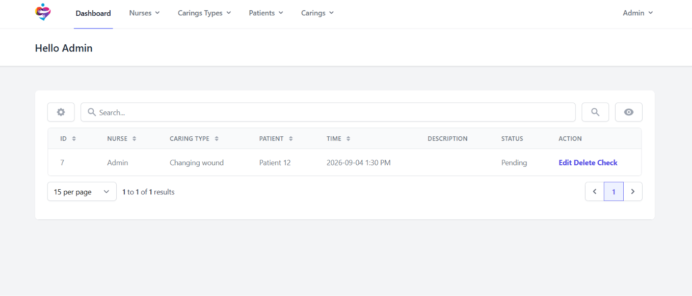
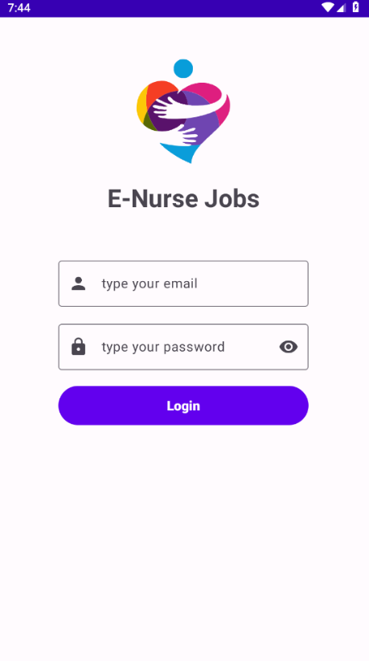

# enurse

[](./LICENSE)
[](./backend/composer.json)
[](./backend/composer.json)
[](./android/app/build.gradle)
[](./android/app/build.gradle)
[](#what-this-is-not)
[](./KNOWN-ISSUES.md)

A two-deliverable university mobile-development project: a Laravel 10 + Splade
admin backend and a Java Android client, built to learn the full stack in one
semester. **The bugs are kept in on purpose.** See
[`KNOWN-ISSUES.md`](./KNOWN-ISSUES.md) for the honest list, and
[`LEARNING.md`](./LEARNING.md) for the lessons.

---

<p align="center">
  
</p>

## What this is

A working cross-platform nurse care-tracking system, built for a university
mobile-development course. The web side ([Laravel 10 + Splade](./backend/)) is
for hospital admins to assign and track "carings" (care tasks) for nurses.
The Android side ([Java + Material 3 + Room + Retrofit](./android/)) is the
floor-nurse app: log in, see your carings, mark them done, receive push
notifications when admins assign a new task.

The feature surface is small but the *learning surface* is large: JWT auth,
Firebase Cloud Messaging, Excel export, Splade + Inertia, Room with FTS4,
Retrofit interceptors, OkHttp auth handling, Material 3, DataBinding,
Navigation Component, MVVM, soft-delete workflows, Swagger / OpenAPI, and more.

| Web admin dashboard | Android main screen |
| --- | --- |
|  |  |


## What this is not

- **Not production software.** It is insecure in several documented ways
  (see [`KNOWN-ISSUES.md`](./KNOWN-ISSUES.md) and
  [`SECURITY.md`](./SECURITY.md)). **Do not deploy it.**
- **Not a maintained library.** There is no support commitment. Issues and
  PRs are welcome as discussion, not as support requests.
- **Not a portfolio piece.** It is a snapshot of a homework project, frozen
  for teaching. The bugs are part of the lesson — they are not being
  silently fixed under the hood.

## Repo layout

```
enurse/
├── README.md               ← you are here
├── LEARNING.md             ← the 20 transferable lessons
├── KNOWN-ISSUES.md         ← the bug catalog with file:line + fix for each
├── LICENSE                 ← MIT
├── CONTRIBUTING.md
├── CODE_OF_CONDUCT.md
├── SECURITY.md
├── .gitignore              ← enurse-level ignores
├── assets/
│   ├── logos/              ← brand assets (PNG / SVG / ICO)
│   ├── screenshots/        ← app screenshots used in REPORT.en.md
├── backend/                ← Laravel 10 + Splade project
│   ├── README.md           ← per-side quickstart + env table + backend-known-issues
│   ├── app/                ← Laravel application code
│   ├── config/             ← Laravel config
│   ├── database/           ← migrations + seeders
│   ├── routes/             ← API + web routes
│   ├── resources/views/    ← Splade / Blade templates
│   └── …                   ← standard Laravel project layout
└── android/                ← Android Studio project
    ├── README.md           ← per-side quickstart + setup + android-known-issues
    ├── app/                ← main application module
    │   ├── google-services.json.example  ← format-valid Firebase placeholder (real file is gitignored)
    │   └── src/main/       ← source code
    └── …                   ← standard Android project layout
```

## Quickstart

The full per-side quickstarts live in [`backend/README.md`](./backend/README.md)
and [`android/README.md`](./android/README.md). TL;DR:

**Backend** (PHP 8.2, Composer, Node 18+, MySQL 8 / MariaDB 10.6):

```bash
cd backend
composer install --ignore-platform-req=php
npm install && npm run build
cp .env.example .env && php artisan key:generate && php artisan jwt:secret --force
php artisan migrate:fresh --seed
php artisan serve            # http://127.0.0.1:8000
```

**Deploy to Wasmer Edge** (production):

```bash
cd backend
wasmer deploy
```

The database is Wasmer's built-in MySQL, auto-provisioned via
`capabilities.database` in `backend/app.yaml`. Migrations are **not** run by
Wasmer: the CLI drops the `jobs:` section when it compiles `app.yaml`, so a
`post-deployment` job never executes. Instead the deploy job in
`.github/workflows/backend.yml` runs `php artisan migrate --force` and
`php artisan db:seed --force` against the Wasmer database after the deploy,
using `WASMER_DB_*` GitHub secrets — no application code, no shared secret in
the app. Seeding on every deploy is intentional here: this app is a
demo/staging environment and the seeders truncate their tables first.

### Android CI

`.github/workflows/android.yml` builds the app and runs its unit tests on every
push to `main` (and on pull requests that touch `android/`):

- JDK 17 + `./gradlew :app:assembleRelease` (the release APK is uploaded as a
  workflow artifact) and `:app:testDebugUnitTest`.
- The real `google-services.json` stays gitignored (BTL6). CI writes it from
the `GOOGLE_SERVICES_JSON_B64` repository secret and fails loudly if the
  decoded file's `package_name` is not `com.example.enursejobs`.

> The `android/` directory contains intentional bugs and scaffold leftovers
> (see [`KNOWN-ISSUES.md`](./KNOWN-ISSUES.md) AB5–AB12) — CI runs against
> exactly that code, bugs included.

> App-level `DB_*` variables are merged *over* the injected ones, so an empty
> value there breaks every request with `[2002] Operation not permitted`.
> Never upload self-referencing `${VAR}` placeholders. See
> [`KNOWN-ISSUES.md` BTL10](./KNOWN-ISSUES.md) (shadowing),
> [`KNOWN-ISSUES.md` BTL11](./KNOWN-ISSUES.md) (the pre-deployment job trap) and
> [`KNOWN-ISSUES.md` BTL12](./KNOWN-ISSUES.md) (the CLI dropping `jobs:`).

App secrets (`APP_KEY`, `JWT_SECRET`, …) live in Wasmer's secret store, never
in `.env`. Upload only the keys Wasmer cannot inject:

```bash
wasmer app secrets create --from-file=.env
```

CI runs tests on every push; deploys happen on push to `main`
(GitHub secret: `WASMER_TOKEN`).

**Android** (Android Studio Hedgehog+, JDK 17, Android SDK 34):

1. Open `android/` in Android Studio.
2. Copy `android/app/google-services.json.example` to
   `android/app/google-services.json` and edit the values to point at your
   own Firebase project, or leave the placeholder for a build-only run.
3. `./gradlew assembleDebug` to build the APK.

## Documentation index

| Doc | Purpose |
| --- | --- |
| [`LEARNING.md`](./LEARNING.md) | The 20 transferable lessons distilled from the bug catalog. |
| [`KNOWN-ISSUES.md`](./KNOWN-ISSUES.md) | Bug catalog — severity, file:line, wrong code, right code. |
| [`backend/README.md`](./backend/README.md) | Backend quickstart, env table, known issues, deployment. |
| [`android/README.md`](./android/README.md) | Android quickstart, Firebase setup, known issues. |
| [`SECURITY.md`](./SECURITY.md) | Why you must not deploy this. |
| [`CONTRIBUTING.md`](./CONTRIBUTING.md) | How to file issues / send PRs. |
| [`CODE_OF_CONDUCT.md`](./CODE_OF_CONDUCT.md) | Contributor Covenant v2.1. |

## License

[MIT](./LICENSE). Copyright (c) 2024 Alaa Hamdan.

## Contributing

See [`CONTRIBUTING.md`](./CONTRIBUTING.md). Issues and PRs are welcome as
discussion, not as support requests.

## Code of conduct

See [`CODE_OF_CONDUCT.md`](./CODE_OF_CONDUCT.md) — Contributor Covenant v2.1.

## Security

See [`SECURITY.md`](./SECURITY.md). This is a learning project, not a
security boundary. **Do not deploy.**
